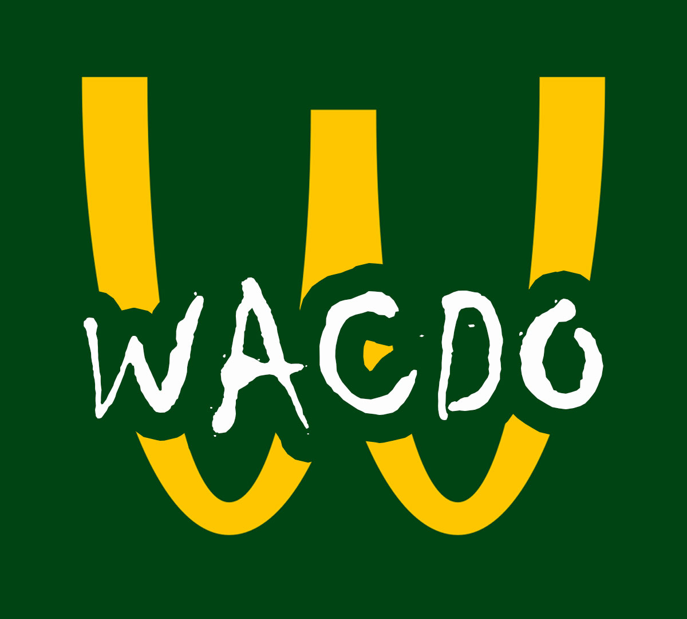

## A propos

L'application "Wacdo" est le résultat d'un projet de formation basé sur le framework Laravel. L'objectif est de mettre en place une application fonctionnelle permettant la gestion des restaurants d'une chaine de restaurant fictive : Wacdo.  
L'application permet de gérer les entités suivantes :

- Les collaborateurs
- Les restaurants
- Les fonctions (postes)
- Les affectations

L'application est pourvue de mesure de sécurité nécessaire, y compris l'authentification et l'autorisation des utilisateurs.  
La connexion et l'utilisation de l'application ne peut être faite que par un compte utilisateur ayant le role d'**Admin** et ayant un **mot de passe**.

## Spécificités Fonctionnelles
### Accueil
Pour les utilisateurs non connectés, cette vue affiche le formulaire de connexion.
### Restaurants
La vue restaurant affiche le listing des restaurants avec la possibilité de filtrer par nom, code postal et/ou ville.  
Un bouton permet d'afficher la vue contenant le formulaire d'ajout de restaurant.
Dans le listing, le nom du restaurant est cliquable pour afficher la vue contenant le détail du restaurant.  
Un bouton permet d'afficher la vue contenant le formulaire d'édition du restaurant et un autre permet la suppression.
Dans la vue détail, on retrouve des indicateurs et un tableau qui liste les affectations en cour dans le restaurant.  
Cette liste est filtrable par nom, fonction et/ou date de début. Un bouton permet d'afficher également l'historique des affectations du restaurant.
### Collaborateurs
La vue collaborateurs affiche le listing des collaborateurs de l'entreprise.  
Ce listing est filtrable, via un formulaire, par nom, prénom et/ou Email.
Un bouton permet d'ajouter un nouveau collaborateur, et un switcher permet d'afficher uniquement les collaborateurs non-affectés à un restaurant.  
Sur chaque ligne du tableau, un bouton permet l'édition et un autre la suppression du collaborateur.  
Lors de l'ajout ou de la modification d'un compte collaborateur, si la sélection du role est 'user' alors le mot de passe saisie ne sera pas enregistré et celui enregistrer en base (passage de admin à user) sera effacé.  
Le nom de chaque collaborateur est cliquable pour afficher la vue détail du collaborateur.  
Dans cette vue, on obtient la liste des affectations en cours pour le collaborateur concerné. Cette liste est filtrable par fonction et/ou date de début.  
Un bouton switch permet d'afficher l'historique complet des affectations du collaborateur.
### Fonctions
La vue **Fonctions** permet d'afficher la liste des postes existants dans l'entreprise.  
La dernière ligne du tableau comprend un formulaire d'ajout de fonction. Dans chaque ligne du tableau, il y a un bouton d'édition et de suppression de la fonction.
Une règle de validation permet de ne pas ajouter deux fois la même fonction.
### Affectations
La vue **Affectations** est l'articulation centrale de l'application, elle permet de faire la liaison entre les restaurants, les fonctions et les collaborateurs.  
Cette vue permet d'afficher l'ensemble des affectations en cours et un bouton permet d'afficher également l'historique en plus.  
Un bouton permet d'afficher la vue contenant le formulaire d'ajout de nouvelle affectation.  
Cette liste est filtrable par :  
- Date de début et de fin de contrat (actif sur la période)
- Affectations en CDD et/ou CDI
- Fonctions
- Ville
  
Dans chaque ligne du tableau, il y a un bouton d'édition et de suppression de la fonction.

## Spécificités Techniques

### La base de donnée

La base de donnée s'articule autour de 4 tables :  
- Restaurants -> Permet le stockage des informations concernant les restaurants
- Fonctions -> Permet le stockage des intitulés de poste disponible dans l'entreprise
- Users -> Permet le stockage des utilisateurs/collaborateurs de l'entreprise
- Affectations -> [Table pivot] Permet de stocker les informations d'affectation des collaborateurs à une fonction et/ou à un restaurant

Les relations entre les tables sont les suivantes :  

### Les autorisations

Les autorisations au niveau **Users** sont gérées à travers des policies (UserPolicy.php).  
Les UserPolicy permettre entre autre de bloqué la modification d'un compte Admin par un autre Admin et la suppression de compte autre que les comptes User.  
Elles donnent également les pleins pouvoir au compte SuperAdmin.  

